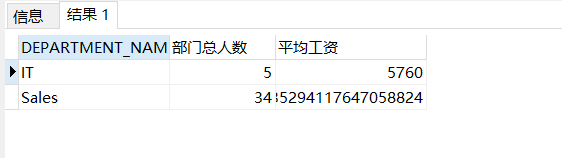
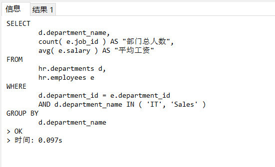
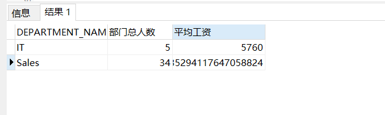
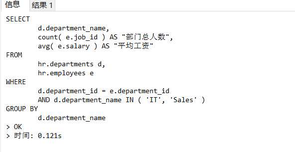
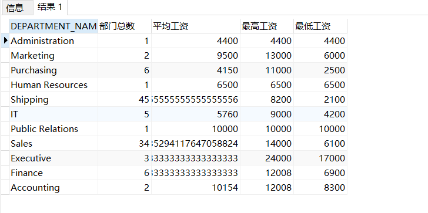

# 实验1：SQL语句的执行计划分析与优化指导

## 一.实验目的：
     分析SQL执行计划，执行SQL语句的优化指导。理解分析SQL语句的执行计划的重要作用。

## 二.实验内容：
     ①对Oracle12c中的HR人力资源管理系统中的表进行查询与分析。
     ②首先运行和分析教材中的样例：本训练任务目的是查询两个部门('IT'和'Sales')的部
     门总人数和平均工资，以下两个查询的结果是一样的。但效率不相同。
     ③设计自己的查询语句，并作相应的分析，查询语句不能太简单。

## 三.实验步骤
### 1.对Oracle12c中的HR人力资源管理系统中的表进行查询与分析。
 
    
### 2.分析两个教材中的查询语句，判断哪个SQL语句是最优的 

  执行上面两个比较复杂的返回相同查询结果数据集的SQL语句，通过分析SQL语句各自的执行计划，
  判断哪个SQL语句是最优的。最后将你认为最优的SQL语句通过sqldeveloper的优化指导工具进行优化指导，看看该工具有没有给出优化建议
    
- 查询1：

```SQL
set autotrace on

SELECT d.department_name,count(e.job_id)as "部门总人数",
avg(e.salary)as "平均工资"
from hr.departments d,hr.employees e
where d.department_id = e.department_id
and d.department_name in ('IT','Sales')
GROUP BY d.department_name;
```
   查询结果截图：
     
   所用时间：
     

- 查询2:


```SQL
set autotrace on

SELECT d.department_name,count(e.job_id)as "部门总人数",
avg(e.salary)as "平均工资"
FROM hr.departments d,hr.employees e
WHERE d.department_id = e.department_id
GROUP BY d.department_name
HAVING d.department_name in ('IT','Sales');
```
   查询结果截图：
     
   所用时间：
     
    
    1）分析：根据Oracle SQL语句的运行结果来看，查询一运用了分组查询的语句：GROUP语句，并用部门姓名进行分组用where语句去找满足条件
    的IT和Sales。大大缩短了查询时间，不需要像查询二一样分组后用HAVING再去大量地筛选。而且查询一的physical reads为0，说明从磁盘请
    求到Buffer Cache的数据量很少，意味着不需要从系统库存里大量全表扫描SQL语句。它的consistent gets为9，意味着它需要从Buffer cache
    中读取的undo数据的block数据为9，相较于第二条SQL语句读取数据更少，效率更高。从运行结果的时间来看，查询一的语句最优，平均用时
    0.091s，比查询二的0.11s平均快了0.02s。
      
     
    2）建议：查询一通过sqldeveloper的优化指导工具进行优化指导，代码为：
    
```SQL
set autotrace on

SELECT
	d.department_name,
	count( e.job_id ) AS "部门总人数",
	avg( e.salary ) AS "平均工资" 
FROM
	hr.departments d,
	hr.employees e 
WHERE
	d.department_id = e.department_id 
	AND d.department_name IN ( 'IT', 'Sales' ) 
GROUP BY
	d.department_name;

```

    
### 3.设计自己的查询语句，并作相应的分析，查询语句不能太简单。  
    1）代码：
```SQL
SELECT d.department_name,count(e.job_id)as "部门总数",
avg(e.salary)as "平均工资",max(e.salary)as "最高工资",
min(e.salary)as "最低工资" 
from hr.departments d,hr.employees e where d.department_id=e.department_id GROUP BY d.department_name;
```    
    
    2）分析：在原来的查找部门总数和平均工资的基础上，新添加查找最高工资最低工资的查询语句。该查询语句通过从部门表和员工表判断
    部门ID和员工ID相等，以部门名分组来达到查询最高工资和最低工资的目的。新添加的查询语句的physical gets等于19，说明自己的
    新增的查询语句从数据库扫描SQL语句量增多。
    
   运行结果截图：
     
    
