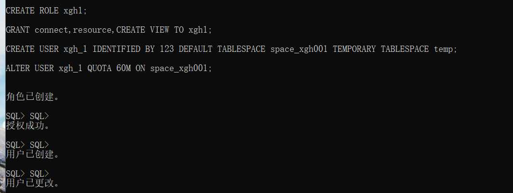
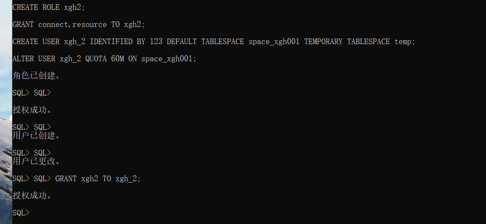
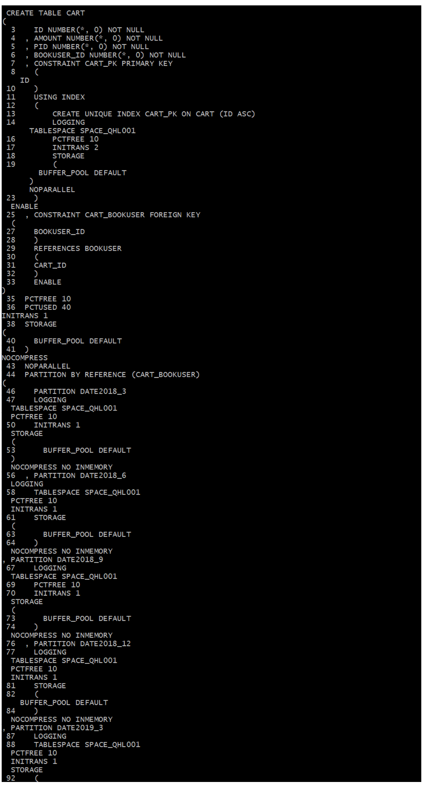
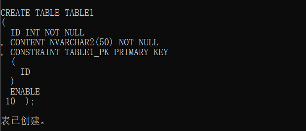
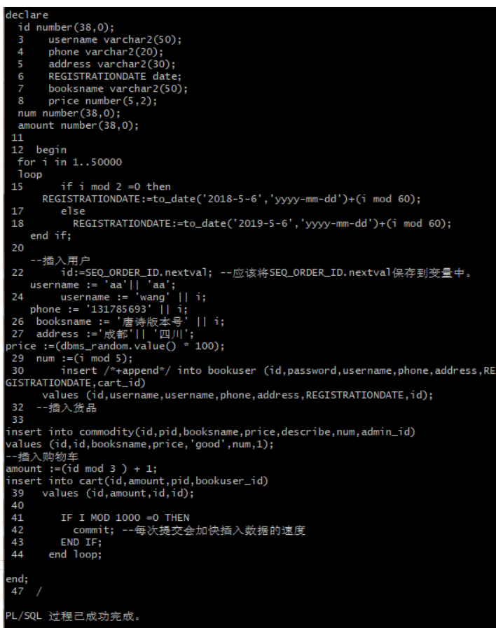
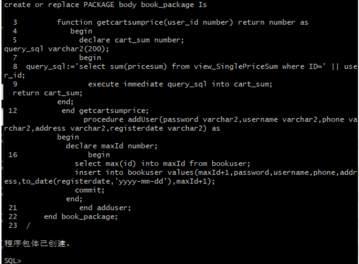
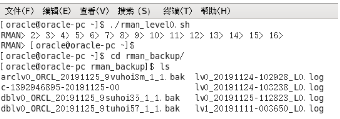
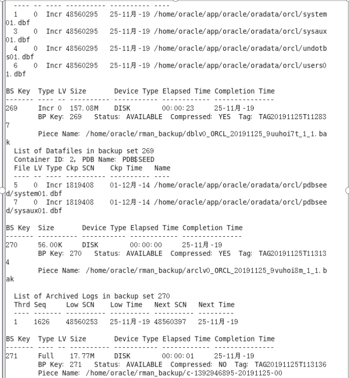
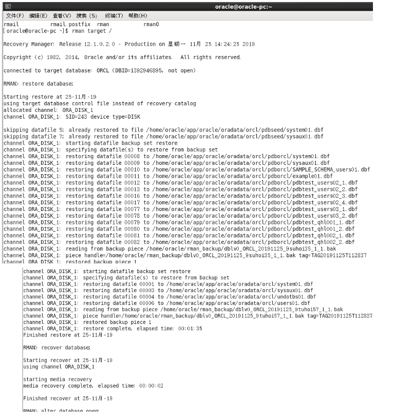
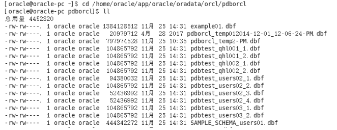

# orcale数据库实验六-成都大学图书管理信息系统

<!-- [TOC] -->

## 一. 概述

成都大学图书管理系统是学校管理图书的重要工具，是学校不可或缺的一部分。随着在校人数的不断增加，系统的数量也不断的上涨。学校工作繁杂，资料众多，人工管理信息的难度也越来越大，显然是不能满足实际的需要，效率也是很低的。并且这种传统的方式存在着众多的弊端，如：保密性差.查询不便.效率低，很难维护和更新等，然而，本系统针对以上的缺点能够极大的提高图书信息管理的效率，也是科学化.正规化的管理，与世界接轨的重要条件。所以如何自动高效地管理信息是这些年来许多人所研究的。


## 二.数据库以及表的创建
### 1.创建表空间

- space_xgh001

```sql
Create Tablespace space_xgh001
datafile
'/home/oracle/app/oracle/oradata/orcl/pdborcl/pdbtest_xgh001_1.dbf'
  SIZE 100M AUTOEXTEND ON NEXT 256M MAXSIZE UNLIMITED,
'/home/oracle/app/oracle/oradata/orcl/pdborcl/pdbtest_xgh001_2.dbf'
  SIZE 100M AUTOEXTEND ON NEXT 256M MAXSIZE UNLIMITED
EXTENT MANAGEMENT LOCAL SEGMENT SPACE MANAGEMENT AUTO;
```

 

- space_xgh002

```sql
Create Tablespace space_xgh002
datafile
'/home/oracle/app/oracle/oradata/orcl/pdborcl/pdbtest_xgh002_1.dbf'
  SIZE 100M AUTOEXTEND ON NEXT 256M MAXSIZE UNLIMITED,
'/home/oracle/app/oracle/oradata/orcl/pdborcl/pdbtest_xgh002_2.dbf'
  SIZE 100M AUTOEXTEND ON NEXT 256M MAXSIZE UNLIMITED
EXTENT MANAGEMENT LOCAL SEGMENT SPACE MANAGEMENT AUTO;
```

 

### 2. 创建角色及用户
用户默认使用表空间space_xgh001
创建第一个角色和用户

- 创建角色xgh1将connect,resource,create view授权给xgh1
- 创建用户xgh_1
- 分配60M空间给xgh_1并将角色xgh1授权给用户xgh_1

```sql
CREATE ROLE xgh1;

GRANT connect,resource,CREATE VIEW TO xgh1;

CREATE USER xgh_1 IDENTIFIED BY 123 DEFAULT TABLESPACE space_xgh001 TEMPORARY TABLESPACE temp;

ALTER USER xgh_1 QUOTA 60M ON space_xgh001;

GRANT xgh1 TO xgh_1;
```

 


### 3.创建第二个角色和用户

- 创建角色xgh2，将connect,resource权限给xgh2
- 创建用户xgh_2
- 分配60M空间给xgh_2并将角色wmj2授权给用户xgh_2

```sql
CREATE ROLE xgh2;

GRANT connect,resource TO xgh2;

CREATE USER xgh_2 IDENTIFIED BY 123 DEFAULT TABLESPACE space_xgh001 TEMPORARY TABLESPACE temp;

ALTER USER xgh_2 QUOTA 60M ON space_xgh001;

GRANT xgh2 TO xgh_2;
```


### 3. 在用户xgh_1下创建表

(1)创建管理员表
- id为主键
学生信息表

|   属性   |   字段   |   注解   |
| :------: | :------: | :------: |
|   编号   | ID NUMBER| 管理员编号 |
|   姓名   | PASSWORD | 管理员姓名 |
| 班级编号 |   ADMIN  | 管理编号 |


```sql
CREATE TABLE ADMINISTRATOR 
(
  ID NUMBER(*, 0) NOT NULL 
, PASSWORD VARCHAR2(20 BYTE) NOT NULL 
, ADMIN VARCHAR2(20 BYTE) NOT NULL 
, CONSTRAINT ADMINISTRATOR_PK PRIMARY KEY 
  (
    ID 
  )
  USING INDEX 
  (
      CREATE UNIQUE INDEX ADMINISTRATOR_PK ON ADMINISTRATOR (ID ASC) 
      LOGGING 
      TABLESPACE SPACE_xgh001 
      PCTFREE 10 
      INITRANS 2 
      STORAGE 
      ( 
        BUFFER_POOL DEFAULT 
      ) 
      NOPARALLEL 
  )
  ENABLE 
) 
LOGGING 
TABLESPACE SPACE_xgh001 
PCTFREE 10 
INITRANS 1 
STORAGE 
( 
  BUFFER_POOL DEFAULT 
) 
NOCOMPRESS 
NO INMEMORY 
NOPARALLEL;
```
  
(2)创建用户表

- id为主键
- 根据注册日期按范围分区
- 分为2018和2019年两个分区，每年按季度划4个子分区

读者表

|   属性   |    字段    |   注解   |
| :------: | :--------: | :------: |
|   编号   |   ID NUMBER  | 读者编号 |
|   密码   |   PASSWORD   | 读者密码 |
|   名字   |   USERNAME   | 读者姓名 |
|   号码   |    PHONE    | 读者号码 |
|   地址   |   ADDRESS   | 上课时间 |
| 登记时间 |   REGISTRATIONDATE  | 时间 |
| 推车编号 |   CART_ID NUMBER    | 编号 |

```sql
CREATE TABLE BOOKUSER 
(
  ID NUMBER(*, 0) NOT NULL 
, PASSWORD VARCHAR2(20 BYTE) NOT NULL 
, USERNAME VARCHAR2(50 BYTE) NOT NULL 
, PHONE VARCHAR2(20 BYTE) NOT NULL 
, ADDRESS VARCHAR2(30 BYTE) NOT NULL 
, REGISTRATIONDATE DATE NOT NULL 
, CART_ID NUMBER(*, 0) NOT NULL 
, CONSTRAINT U_PK PRIMARY KEY 
  (
    ID 
  )
  USING INDEX 
  (
      CREATE UNIQUE INDEX U_PK ON BOOKUSER (ID ASC) 
      LOGGING 
      TABLESPACE SPACE_xgh001 
      PCTFREE 10 
      INITRANS 2 
      STORAGE 
      ( 
        BUFFER_POOL DEFAULT 
      ) 
      NOPARALLEL 
  )
  ENABLE 
) 
TABLESPACE SPACE_xgh001 
PCTFREE 10 
INITRANS 1 
STORAGE 
( 
  BUFFER_POOL DEFAULT 
) 
NOCOMPRESS 
NOPARALLEL 
PARTITION BY RANGE (REGISTRATIONDATE) 
SUBPARTITION BY RANGE (REGISTRATIONDATE) 
(
  PARTITION DATE2018 VALUES LESS THAN (TO_DATE(' 2018-12-31 00:00:00', 'SYYYY-MM-DD HH24:MI:SS', 'NLS_CALENDAR=GREGORIAN')) 
  TABLESPACE SPACE_xgh001 
  PCTFREE 10 
  INITRANS 1 
  STORAGE 
  ( 
    BUFFER_POOL DEFAULT 
  ) 
  NOCOMPRESS NO INMEMORY 
  (
    SUBPARTITION DATE2018_3 VALUES LESS THAN (TO_DATE(' 2018-03-31 00:00:00', 'SYYYY-MM-DD HH24:MI:SS', 'NLS_CALENDAR=GREGORIAN')) 
    NOCOMPRESS NO INMEMORY  
  , SUBPARTITION DATE2018_6 VALUES LESS THAN (TO_DATE(' 2018-06-30 00:00:00', 'SYYYY-MM-DD HH24:MI:SS', 'NLS_CALENDAR=GREGORIAN')) 
    NOCOMPRESS NO INMEMORY  
  , SUBPARTITION DATE2018_9 VALUES LESS THAN (TO_DATE(' 2018-09-30 00:00:00', 'SYYYY-MM-DD HH24:MI:SS', 'NLS_CALENDAR=GREGORIAN')) 
    NOCOMPRESS NO INMEMORY  
  , SUBPARTITION DATE2018_12 VALUES LESS THAN (TO_DATE(' 2018-12-31 00:00:00', 'SYYYY-MM-DD HH24:MI:SS', 'NLS_CALENDAR=GREGORIAN')) 
    NOCOMPRESS NO INMEMORY  
  )  
, PARTITION DATE2019 VALUES LESS THAN (TO_DATE(' 2019-12-31 00:00:00', 'SYYYY-MM-DD HH24:MI:SS', 'NLS_CALENDAR=GREGORIAN')) 
  TABLESPACE SPACE_xgh001 
  PCTFREE 10 
  INITRANS 1 
  STORAGE 
  ( 
    BUFFER_POOL DEFAULT 
  ) 
  NOCOMPRESS NO INMEMORY 
  (
    SUBPARTITION DATE2019_3 VALUES LESS THAN (TO_DATE(' 2019-03-31 00:00:00', 'SYYYY-MM-DD HH24:MI:SS', 'NLS_CALENDAR=GREGORIAN')) 
    NOCOMPRESS NO INMEMORY  
  , SUBPARTITION DATE2019_6 VALUES LESS THAN (TO_DATE(' 2019-06-30 00:00:00', 'SYYYY-MM-DD HH24:MI:SS', 'NLS_CALENDAR=GREGORIAN')) 
    NOCOMPRESS NO INMEMORY  
  , SUBPARTITION DATE2019_9 VALUES LESS THAN (TO_DATE(' 2019-09-30 00:00:00', 'SYYYY-MM-DD HH24:MI:SS', 'NLS_CALENDAR=GREGORIAN')) 
    NOCOMPRESS NO INMEMORY  
  , SUBPARTITION DATE2019_12 VALUES LESS THAN (TO_DATE(' 2019-12-31 00:00:00', 'SYYYY-MM-DD HH24:MI:SS', 'NLS_CALENDAR=GREGORIAN')) 
    NOCOMPRESS NO INMEMORY  
  )  
);
```


(3)创建商品表

商品表

|   属性   |    字段    |   注解   |
| :------: | :--------: | :------: |
|   编号   |   ID NUMBER    | 商品编号 |
|   编号   |   PID NUMBER   | 购物卡密码 |
|   名字   |   BOOKSNAME    | 商品名字 |
|   价格   |   PRICE NUMBER | 商品价格号码 |
|   描述   |   DESCRIBE   | 商品描述|
|   编号   |   NUM NUMBE  | 序号 |
| 管理编号 |   ADMIN_ID NUMBER | 管理编号 |

```sql
CREATE TABLE COMMODITY 
(
  ID NUMBER(*, 0) NOT NULL 
, PID NUMBER(*, 0) NOT NULL 
, BOOKSNAME VARCHAR2(20 BYTE) NOT NULL 
, PRICE NUMBER NOT NULL 
, DESCRIBE VARCHAR2(50 BYTE) NOT NULL 
, NUM NUMBER(*, 0) NOT NULL 
, ADMIN_ID NUMBER(*, 0) NOT NULL 
, CONSTRAINT COMMODITY_PK PRIMARY KEY 
  (
    ID 
  )
  USING INDEX 
  (
      CREATE UNIQUE INDEX COMMODITY_PK ON COMMODITY (ID ASC) 
      LOGGING 
      TABLESPACE SPACE_xgh001 
      PCTFREE 10 
      INITRANS 2 
      STORAGE 
      ( 
        BUFFER_POOL DEFAULT 
      ) 
      NOPARALLEL 
  )
  ENABLE 
) 
LOGGING 
TABLESPACE SPACE_xgh001 
PCTFREE 10 
INITRANS 1 
STORAGE 
( 
  BUFFER_POOL DEFAULT 
) 
NOCOMPRESS 
NO INMEMORY 
NOPARALLEL;
```


(4)创建购物车表

- 用户表字段BOOKUSER_ID为购物车表的外键
- 购物车采用引用分区

购物车表

|   属性   |    字段    |   注解   |
| :------: | :--------: | :------: |
|   编号   |   ID NUMBER  | 购物车编号 |
|   总额   |   AMOUNT NUMBER  | 商品总额 |
|   名字   |   PID NUMBER     | 购物卡编号|
|   编号   |   BOOKUSER_ID    | 读者编号 |


```sql
CREATE TABLE CART 
(
  ID NUMBER(*, 0) NOT NULL 
, AMOUNT NUMBER(*, 0) NOT NULL 
, PID NUMBER(*, 0) NOT NULL 
, BOOKUSER_ID NUMBER(*, 0) NOT NULL 
, CONSTRAINT CART_PK PRIMARY KEY 
  (
    ID 
  )
  USING INDEX 
  (
      CREATE UNIQUE INDEX CART_PK ON CART (ID ASC) 
      LOGGING 
      TABLESPACE SPACE_xgh001 
      PCTFREE 10 
      INITRANS 2 
      STORAGE 
      ( 
        BUFFER_POOL DEFAULT 
      ) 
      NOPARALLEL 
  )
  ENABLE 
, CONSTRAINT CART_BOOKUSER FOREIGN KEY
  (
  BOOKUSER_ID 
  )
  REFERENCES BOOKUSER
  (
  CART_ID 
  )
  ENABLE 
) 
PCTFREE 10 
PCTUSED 40 
INITRANS 1 
STORAGE 
( 
  BUFFER_POOL DEFAULT 
) 
NOCOMPRESS 
NOPARALLEL 
PARTITION BY REFERENCE (CART_BOOKUSER) 
(
  PARTITION DATE2018_3 
  LOGGING 
  TABLESPACE SPACE_xgh001 
  PCTFREE 10 
  INITRANS 1 
  STORAGE 
  ( 
    BUFFER_POOL DEFAULT 
  ) 
  NOCOMPRESS NO INMEMORY  
, PARTITION DATE2018_6 
  LOGGING 
  TABLESPACE SPACE_xgh001 
  PCTFREE 10 
  INITRANS 1 
  STORAGE 
  ( 
    BUFFER_POOL DEFAULT 
  ) 
  NOCOMPRESS NO INMEMORY  
, PARTITION DATE2018_9 
  LOGGING 
  TABLESPACE SPACE_xgh001 
  PCTFREE 10 
  INITRANS 1 
  STORAGE 
  ( 
    BUFFER_POOL DEFAULT 
  ) 
  NOCOMPRESS NO INMEMORY  
, PARTITION DATE2018_12 
  LOGGING 
  TABLESPACE SPACE_xgh001 
  PCTFREE 10 
  INITRANS 1 
  STORAGE 
  ( 
    BUFFER_POOL DEFAULT 
  ) 
  NOCOMPRESS NO INMEMORY  
, PARTITION DATE2019_3 
  LOGGING 
  TABLESPACE SPACE_wmj001 
  PCTFREE 10 
  INITRANS 1 
  STORAGE 
  ( 
    BUFFER_POOL DEFAULT 
  ) 
  NOCOMPRESS NO INMEMORY  
, PARTITION DATE2019_6 
  LOGGING 
  TABLESPACE SPACE_xgh001 
  PCTFREE 10 
  INITRANS 1 
  STORAGE 
  ( 
    BUFFER_POOL DEFAULT 
  ) 
  NOCOMPRESS NO INMEMORY  
, PARTITION DATE2019_9 
  LOGGING 
  TABLESPACE SPACE_xgh001 
  PCTFREE 10 
  INITRANS 1 
  STORAGE 
  ( 
    BUFFER_POOL DEFAULT 
  ) 
  NOCOMPRESS NO INMEMORY  
, PARTITION DATE2019_12 
  LOGGING 
  TABLESPACE SPACE_xgh001 
  PCTFREE 10 
  INITRANS 1 
  STORAGE 
  ( 
    BUFFER_POOL DEFAULT 
  ) 
  NOCOMPRESS NO INMEMORY  
);
```


(5)论坛表

```sql
CREATE TABLE TABLE1 
(
  ID INT NOT NULL 
, CONTENT NVARCHAR2(50) NOT NULL 
, CONSTRAINT TABLE1_PK PRIMARY KEY 
  (
    ID 
  )
  ENABLE 
);
```
  
## 三. 数据库查询

## 1. 添加用户及权限管理
oracle中的表就是一张存储数据的表。表空间是逻辑上的划分。方便管理的。
数据表空间 (Tablespace) 
存放数据总是需要空间， Oracle把一个数据库按功能划分若干空间来保存数据。当然数据存放在磁盘最终是以文件形式，所以一盘一个数据表空间包含一个以上的物理文件
数据表。
在仓库，我们可能有多间房子，每个房子又有多个货架，每架又有多层。 我们在数据库中存放数据，最终是数据表的单元来存储与管理的。
数据文件。
以上几个概念都是逻辑上的， 而数据文件则是物理上的。就是说，数据文件是真正“看得着的东西”，它在磁盘上以一个真实的文件体现。

创建表空间：
~~~
格式: create tablespace 表间名 datafile '数据文件名' size 表空间大小
                create tablespace data_test datafile 'e:\oracle\oradata\test\data_1.dbf' size 2000M;
                create tablespace idx_test datafile 'e:\oracle\oradata\test\idx_1.dbf' size 2000M;
                (*数据文件名 包含全路径, 表空间大小 2000M 表是 2000兆) 
~~~

建好tablespace, 就可以建用户

~~~
格式: create user 用户名 identified by 密码 default tablespace 表空间表;
                create user study identified by study default tablespace data_test;
                (*我们创建一个用户名为 study,密码为 study, 缺少表空间为 data_test -这是在第二步建好的.)
                (*缺省表空间表示 用户study今后的数据如果没有专门指出，其数据就保存在 data_test中, 也就是保存在对应的物理文件 e:\oracle\oradata\test\data_1.dbf中)
~~~

创建用户并指定表空间

~~~
CREATE USER cici IDENTIFIED BY cici PROFILE DEFAULT DEFAULT TABLESPACE CICI ACCOUNT UNLOCK;
create user jykl identified by jykl default tablespace jykl_data temporary tablespace jykl_temp;
授权给新用户
GRANT connect, resource TO cici;
grant create session to cici;
~~~

授权给新用户

~~~
  grant connect,resource to study; 
    --表示把 connect,resource权限授予study用户
    grant dba to study;
    --表示把 dba权限授予给 study
~~~

创建数据表

在上面，我们已建好了用户 study 我们现在进入该用户 
sqlplusw study/study@test   然后就可以在用户study中创建数据表了
格式: create table 数据表名 

(1)分别创建两个用户xgh_user1和xgh_user2,并允许他们是使用xgh_space1表空间
create user xgh_user1 IDENTIFIED by 123;
create user xgh_user2 IDENTIFIED by 123;
alter user xgh_user1 quota unlimited on space_xgh001 ;
alter user xgh_user2 quota unlimited on space_xgh001;

(2)创建两个角色xgh_role1，xgh_role2，并分别赋予xgh_role1，xgh_role2读任何表和读、修改任何表的权利
create role xgh_role1;
create role xgh_role2;
grant select any table to xgh_role1;
grant select any table to xgh_role2;
grant update any table to xgh_role2;


(3)将xgh_role1，xgh_role2分别赋予给用户xgh_user1，xgh_user2
grant xgh_role1 to xgh_user1;
grant xgh_role2 to xgh_user2;

## 2.创建视图计算每个用户购车中单个商品的总价

- 视图(view)，也称虚表, 不占用物理空间，这个也是相对概念，因为视图本身的定义语句还是要存储在数据字典里的。视图只有逻辑定义。每次使用的时候,只是重新执行SQL。
- 视图是从一个或多个实际表中获得的，这些表的数据存放在数据库中。那些用于产生视图的表叫做该视图的基表。一个视图也可以从另一个视图中产生。
- 视图的定义存在数据库中，与此定义相关的数据并没有再存一份于数据库中。通过视图看到的数据存放在基表中。
- 视图看上去非常象数据库的物理表，对它的操作同任何其它的表一样。当通过视图修改数据时，实际上是在改变基表中的数据；相反地，基表数据的改变也会自动反映在由基表产生的视图中。由于逻辑上的原因，有些Oracle视图可以修改对应的基表，有些则不能（仅仅能查询）。
- 还有一种视图：物化视图（MATERIALIZED VIEW ），也称实体化视图，快照 （8i 以前的说法） ，它是含有数据的，占用存储空间。

~~~sql
 CREATE OR REPLACE FORCE EDITIONABLE VIEW "STUDENT_LFT"."MYVIEW_CURRICULUM" ("ID") AS 
  SELECT id FROM curriculum;
  
CREATE OR REPLACE FORCE EDITIONABLE VIEW "STUDENT_LFT"."MYVIEW_MYCLASS" ("ID") AS 
  SELECT name FROM myclass;
  
CREATE OR REPLACE FORCE EDITIONABLE VIEW "STUDENT_LFT"."MYVIEW_STUDENT" ("ID") AS 
  SELECT name FROM student;
  
  CREATE OR REPLACE FORCE EDITIONABLE VIEW "STUDENT_LFT"."MYVIEW_SUBJECT" ("ID") AS 
  SELECT name FROM subject;
  
  CREATE OR REPLACE FORCE EDITIONABLE VIEW "STUDENT_LFT"."MYVIEW_TEACHER" ("ID") AS 
  SELECT name FROM teacher;
~~~
```sql
create or replace  view view_SinglePriceSum
as 
select b.id,b.username,co.booksname,(co.price*ca.amount) pricesum from COMMODITY co,cart ca,BOOKUSER b where co.pid=ca.pid and ca.BOOKUSER_ID =b.id;
select * from view_SinglePriceSum;
```


**用户xgh_1空间不足，修改xgh_1空间大小**

```sql
ALTER USER wmj_1 QUOTA 90M ON space_xgh001;
```

### 3. 插入用户、商品、购物车数据(向数据库中写入数据共计50000多个数据)
```sql
declare
  id number(38,0);
  username varchar2(50);
  phone varchar2(20);
  address varchar2(30);
  REGISTRATIONDATE date;
  booksname varchar2(50);
  price number(5,2);
  num number(38,0);
  amount number(38,0);
  
begin
  for i in 1..50000
  loop
    if i mod 2 =0 then
      REGISTRATIONDATE:=to_date('2018-5-6','yyyy-mm-dd')+(i mod 60);
    else
      REGISTRATIONDATE:=to_date('2019-5-6','yyyy-mm-dd')+(i mod 60);
    end if;

    --插入用户
    id:=SEQ_ORDER_ID.nextval; --应该将SEQ_ORDER_ID.nextval保存到变量中。
    username := 'aa'|| 'aa';
    username := 'wang' || i;
    phone := '131785693' || i;
	booksname := '十万个为什么' || i;
	address :='云南'|| '昆明';
	price :=(dbms_random.value() * 100);
	num :=(i mod 5);
    insert /*+append*/ into bookuser (id,password,username,phone,address,REGISTRATIONDATE,cart_id)
      values (id,username,username,phone,address,REGISTRATIONDATE,id);
	--插入货品
		
	insert into commodity(id,pid,booksname,price,describe,num,admin_id)
		values (id,id,booksname,price,'good',num,1);
	--插入购物车
	amount :=(id mod 3 ) + 1;
	insert into cart(id,amount,pid,bookuser_id)
	 	values (id,amount,id,id);

    IF I MOD 1000 =0 THEN
      commit; --每次提交会加快插入数据的速度
    END IF;
  end loop;
end;
```


### 4.创建程序包、存储过程、函数执行分析计划（PL/SQL设计）

 过程和函数由以下4部分： 

- 签名或头
- 关键字IS或AS
- 局部声明（可选）
- BEGIN和END之间的过程体（包括异常处理程序）

 简单示例： 

~~~sql
create or replace procedure show_line(ip_line_length in number, ip_separator in varchar2)
is 
actual_line varchar2(150);
begin
     insert into t_user(id,name,sex)values(ip_line_length,ip_separator,ip_line_length);
     for idx in 1..ip_line_length loop
         actual_line := actual_line||ip_separator;
     end loop;
     dbms_output.put_line(actual_line);
exception when others then
          dbms_output.put_line(SQLERRM);
end;

~~~

如下调用：

```sql
begin    show_line(50,'=');end;/
```

在SQLPLUS里面调用：

```sql
SQL> BEGIN2        show_line(50,'=');3    END;
```
几点说明：
1、参数没有指定长度，当有实际数据传递进来的时候，参数的长度才被确定。
2、局部声明为：actual_line varchar2(150);
3、使用命令SQL> show errors在SQLPLUS里面查看错误。

**创建程序包**

- 函数getcartsumprice计算每个用户的购物车商品总金额
- 存储过程adduser插入用户信息

```sql
create or replace PACKAGE book_package Is
   function getcartsumprice(user_id number) return number;
   procedure adduser(password varchar2,username varchar2,phone varchar2,address varchar2,registerdate VARCHAR2);
end book_package;
```
  

**创建函数、存储过程**

```sql
create or replace PACKAGE body book_package Is
 
       function getcartsumprice(user_id number) return number as
          begin
            declare cart_sum number;
			query_sql varchar2(200);
            begin
			query_sql:='select sum(pricesum) from view_SinglePriceSum where ID=' || user_id;
              execute immediate query_sql into cart_sum;
			  return cart_sum;
            end;
        end getcartsumprice;
                  procedure addUser(password varchar2,username varchar2,phone varchar2,address varchar2,registerdate varchar2) as
            begin
              declare maxId number;
              begin
                select max(id) into maxId from bookuser;
                insert into bookuser values(maxId+1,password,username,phone,address,to_date(registerdate,'yyyy-mm-dd'),maxId+1);
                commit;
              end;
            end adduser;
    end book_package;
```


**存储过程、函数执行分析**
使用自定义函数getcartsumprice（）查询id号为20011的用户购物车商品总价

```sql
select BOOK_PACKAGE.getcartsumprice(20011) from dual;
```

 

使用存储过程adduser插入用户数据

```sql
set serveroutput on
declare
begin
BOOK_PACKAGE.addUser('131','cwd','125626','hongkong','2019-05-02');
end;
```


**执行计划分析**

```sql
select * from BOOKUSER b,COMMODITY co,CART ca where b.id=ca.BOOKUSER_ID and ca.PID=co.PID and
b.REGISTRATIONDATE between to_date('2018-1-1','yyyy-mm-dd') and to_date('2018-6-1','yyyy-mm-dd');
```


## 四.表空间使用状况

```sql
SELECT a.tablespace_name "表空间名",
total "表空间大小",
free "表空间剩余大小",
(total - free) "表空间使用大小",
total / (1024 * 1024 * 1024) "表空间大小(G)",
free / (1024 * 1024 * 1024) "表空间剩余大小(G)",
(total - free) / (1024 * 1024 * 1024) "表空间使用大小(G)",
round((total - free) / total, 4) * 100 "使用率 %"
FROM (SELECT tablespace_name, SUM(bytes) free
FROM dba_free_space
GROUP BY tablespace_name) a,
(SELECT tablespace_name, SUM(bytes) total
FROM dba_data_files
GROUP BY tablespace_name) b
WHERE a.tablespace_name = b.tablespace_name
```

 

## 五.备份恢复

### 据库备份

**ORACLE数据库备份与恢复详解**

Oracle的备份与恢复有三种标准的模式，大致分为两 大类，备份恢复(物理上的)以及导入导出(逻辑上的)，而备份恢复又可以根据数据库的工作模式分为非归档模式(Nonarchivelog-style) 和归档模式(Archivelog-style),通常，我们把非归档模式称为冷备份，而相应的把归档模式称为热备份。

### 热备份和冷备份优缺点

#### 热备份的优点是：

 1．可在表空间或数据文件级备份，备份时间短。 

 2．备份时数据库仍可使用。 

 3．可达到秒级恢复（恢复到某一时间点上）。 

 4．可对几乎所有数据库实体作恢复。 

 5．恢复是快速的，在大多数情况下在数据库仍工作时恢复。 

#### 热备份的不足是：

 1．不能出错，否则后果严重。 

 2．若热备份不成功，所得结果不可用于时间点的恢复。 

 3．因难维护，所以要特别仔细小心，不允许“以失败而告终”。 

#### 冷备份的优点是：

 1．是非常快速的备份方法（只需拷贝文件） 

 2．容易归档（简单拷贝即可） 

 3．容易恢复到某个时间点上（只需将文件再拷贝回去） 

 4．能与归档方法相结合，作数据库“最新状态”的恢复。 

 5．低度维护，高度安全。 

#### 冷备份不足是：

 1．单独使用时，只能提供到“某一时间点上”的恢复。 

 2．在实施备份的全过程中，数据库必须要作备份而不能作其它工作。也就是说，数据库必须是关闭状态。


 3．若磁盘空间有限，只能拷贝到磁带等其它外部存储设备上，速度会很慢。 

 4．不能按表或按用户恢复。

### 物理备份之冷备份：

   当数据库可以暂时处于关闭状态时，我们需要将它在这一稳定时刻的数据相关文件转移到安全的区域，当数据库遭到破坏，再从安全区域将备份的数据库相关文件拷 贝回原来的位置，这样，就完成了一次快捷安全等数据转移。由于是在数据库不提供服务的关闭状态，所以称为冷备份。冷备份具有很多优良特性，比如上面图中我 们提到的，快速，方便，以及高效。一次完整的冷备份步骤应该是：

   1，首先关闭数据库（shutdown normal）

   2，拷贝相关文件到安全区域（利用操作系统命令拷贝数据库的所有的数据文件、日志文件、控制文件、参数文件、口令文件等（包括路径））

   3，重新启动数据库（startup）

   以上的步骤我们可以用一个脚本来完成操作：

~~~
   su – oracle <   sqlplus /nolog 
   connect / as sysdba
   shutdown immediate;
   !cp 文件  备份位置（所有的日志、数据、控制及参数文件）;
   startup;
   exit;
~~~

   这样，我们就完成了一次冷备份，请确定你对这些相应的目录（包括写入的目标文件夹）有相应的权限。
   恢复的时候，相对比较简单了，我们停掉数据库，将文件拷贝回相应位置，重启数据库就可以了，当然也可以用脚本来完成。


- 备份./rman_level0.sh



- 查看备份内容





- 删除数据


- 恢复备份



- 数据已恢复



### 六.实现数据库整体的异地备份(容灾)

  Data Guard 是Oracle的集成化灾难恢复解决方案，该技术可以维护生产数据库一个或多个同步备份，由一个主数据库和多个备用数据库组成，并形成一个独立的、易于管理的数据保护方案。
Data Guard 备用数据库可以与主系统位于相同的数据中心，也可以是在地理位置上分布较远的远程灾难备份中心。

  Data Guard 的基本原理是，当某次事务处理对生产数据库中的数据做出更改时，Oracle 数据库将在一个联机重做日志 文件中记录此次更改。在DataGuard中可以配置写日志的这个过程，除了把日志记录到本地的联机日志文件和归档日志文件中，还可以通过网络，把日志信息发送的远程的备用数据库服务器上。这个备用日志文件写入过程可以是实时，同步的，以实现零数据丢失(最大保护模式);也可以是异步的，以减少对网络带宽的压力(最大可用性模式);或者是通过归档日志文件、一个日志文件的批量传输模式，以减少对生产系统的性能影响(最大性能模式)。当备份数据库接收到日志信息后，Data Guard 可以自动利用日志信息实现数据的同步。当主数据库打开并处于活动状态时，备用数据库可以执行恢复操作，如果主数据库出现了故障，备用数据库即可以被激活并接管生产数据库的工作。

  安装配置Data Guard的步骤如下:

(1)将主数据库设置成归档状态和自动归档模式

(3)在主数据库 上创建备用数据库控制文件、初始化参数文件:

(4)把将主数据库备份文件、控制文件和初始化参数文件复制到备用数据库上;

(5)设置 备用数据库控制文件、初始化参数文件和备用数据库侦听;

(6) 设置备用数据库连接主数据库的服务名与主数据库到备用数据库的服务名;

(7)启动备用数据库实例， 初始化日 志应用服务并且将备用数据库设置成standby;

(8)启动归档到备用数据库。

 

